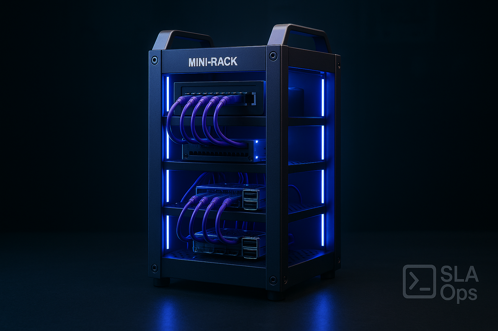

# mini-rack-t2
My personal build of: DeskPi RackMate T2 Rackmount - 12U Mini-Rack
# HomeLab Mini-Rack Project

## Project Overview
This repository documents the development of a compact mini-rack setup designed for Kubernetes (K3s) experimentation, container development, and application testing. As an extension of an existing HomeLab environment (which already includes Proxmox virtualization and NAS storage), this project serves as a dedicated platform for learning container orchestration and developing microservices architectures in a physical form factor.

## Current Status
As of May 6, 2025, all components have been ordered and are awaiting delivery. This README documents the planned hardware configuration and will be updated as the build progresses.

## Planned Implementation
This mini-rack will serve as a dedicated environment for:

1. **Kubernetes Learning**: Initial deployment of K3s lightweight Kubernetes for container orchestration
2. **Container Development**: Testing and validating custom-built containers including Python, Ansible, and Django environments
3. **Application Testing**: Deploying and testing microservices applications in a controlled environment
4. **CI/CD Experimentation**: Possible integration with existing development workflows

## Development Environment
This mini-rack is designed to integrate seamlessly with modern development tools:

- **Visual Studio Code Remote Development**: Using VS Code's Remote SSH functionality to develop directly on the cluster nodes
- **AI-Assisted Development**: Leveraging Augment AI agent for accelerating development tasks, including:
  - Kubernetes configuration assistance
  - Container definition and orchestration
  - Python, Ansible, and Django development
  - Machine Control Programs (MCPs) for K3s and Raspbian OS
- **Remote Pair Programming**: Enabling collaborative development through shared remote sessions
- **Cross-Platform Testing**: Building and testing applications across different container environments

## Hardware Specifications

### Rack Infrastructure
- **DeskPi T2 Mini-Rack** - 12U rackmount server cabinet designed for network servers and AV equipment
  - Form Factor: 12U
  - Application: Network servers, audio/video equipment
  - URL: [DeskPi RackMate T2](https://deskpi.com/products/deskpi-rackmate-t2-rackmount-12u-server-cabinet-for-network-servers-audio-and-video-equipment)

### Networking Equipment
- **Patch Panel** - GeeekPi 12 Port Patch Panel
  - Form Factor: 0.5U
  - Ports: 12
  - Type: CAT6
  - Compatibility: DeskPi RackMate T1/T0/T2 and 10 Inch Server Rack/Network Cabinet
  - URL: [GeeekPi 12 Port Patch Panel](https://www.amazon.com/dp/B0D5XPNHHF)

- **Network Switch** - YuanLey 8 Port Gigabit PoE Switch
  - Ports: 8 PoE+ ports (1000Mbps) + 2 Gigabit uplink + 1 SFP port
  - Power: 120W 802.3af/at
  - Features: Metal housing, QoS, unmanaged plug and play, AI smart detection
  - URL: [YuanLey 8 Port Gigabit PoE Switch](https://www.amazon.com/dp/B08PJPX47D)

### Computing Hardware
- **Raspberry Pi 5** (Quantity: 4)
  - Model: Raspberry Pi 5 (4GB RAM)
  - URL: [Raspberry Pi 5 (4GB)](https://www.amazon.com/dp/B0CK3L9WD3)

- **Raspberry Pi HAT** (Quantity: 4)
  - Model: GeeekPi P33 M.2 NVME M-Key PoE+ Hat with Official Pi 5 Active Cooler
  - Features: M.2 NVMe SSD support, PoE+ functionality, official Pi 5 active cooling
  - Storage: Supports M.2 NVMe SSDs in sizes 2230/2242/2260/2280
  - Power: Utilizing PoE from the YuanLey switch
  - URL: [GeeekPi P33 M.2 NVME PoE+ Hat](https://www.amazon.com/dp/B0D8JC3MXQ)

- **Additional Mini-PCs** - Various pre-owned mini-PCs (details not specified)

### Cabling
- **Short Patch Cables** - Rapink Cat6/Cat6a Patch Cables
  - Length: 0.5ft (24 Pack)
  - Type: Cat6a (10G Support)
  - Features: Slim, snagless, flexible
  - Color: Purple
  - URL: [Rapink 0.5ft Cat6a Patch Cables](https://www.amazon.com/dp/B0DWTW5RVK)

- **Longer Patch Cables** - Rapink Cat6/Cat6a Patch Cables
  - Length: 3ft (24 Pack)
  - Type: Cat6a (30G Support)
  - Features: Slim, snagless, flexible
  - Color: Purple
  - URL: [Rapink 3ft Cat6a Patch Cables](https://www.amazon.com/dp/B0DWTQWHYV)

### Fabrication Equipment
- **3D Printer** - Creality K1C 3D Printer (2024 New Version)
  - Print Speed: 600mm/s high-speed
  - Features: Auto leveling, clog-free robust direct extruder, AI camera
  - Temperature: 300°C printing capability
  - Special Feature: Support for carbon fiber filaments
  - Model: K1 SE upgraded model
  - URL: [Creality K1C 3D Printer](https://www.amazon.com/dp/B0DNPZW6BY)
  - Note: This 3D printer was purchased specifically for this project. First foray into 3D printing — fingers crossed this wasn't just an elaborate excuse to justify buying a "space-age hot glue gun" that will end up collecting dust after printing one wonky Benchy boat.

- **Filament** - SUNLU PLA Plus Filament
  - Material: PLA+
  - Diameter: 1.75mm
  - URL: [SUNLU PLA+ Filament](https://www.amazon.com/dp/B0C4TNQZYY)

## Technical Design Notes
- Custom 3D printed mounting brackets and adapters will be designed for integrating various components into the rack system
- The mini-rack will house both Raspberry Pi cluster and various mini-PCs in a unified rack mount solution
- Expandability considered with patch panel and networking infrastructure
- PoE switch powers the Raspberry Pi 5 cluster via the PoE HATs, eliminating the need for separate power supplies
- NVMe drives via the GeeekPi HATs provide significantly faster storage performance compared to standard SD cards
- High-speed 3D printer enables rapid prototyping of custom rack components with advanced materials support
- The combination of PoE power and NVMe storage creates a high-performance, cable-minimized Raspberry Pi cluster

## Future Expansion Possibilities
- Integration with existing HomeLab Proxmox environment
- Expansion with additional compute nodes
- Deployment of monitoring and observability tools
- Implementation of GitOps workflows

## Repository Structure
This repository will be updated with:
- Build documentation and photos
- 3D printing designs and files
- Configuration scripts and templates
- Network topology diagrams
- Software deployment instructions

## License
TBD

---
*Last updated: May 6, 2025*
